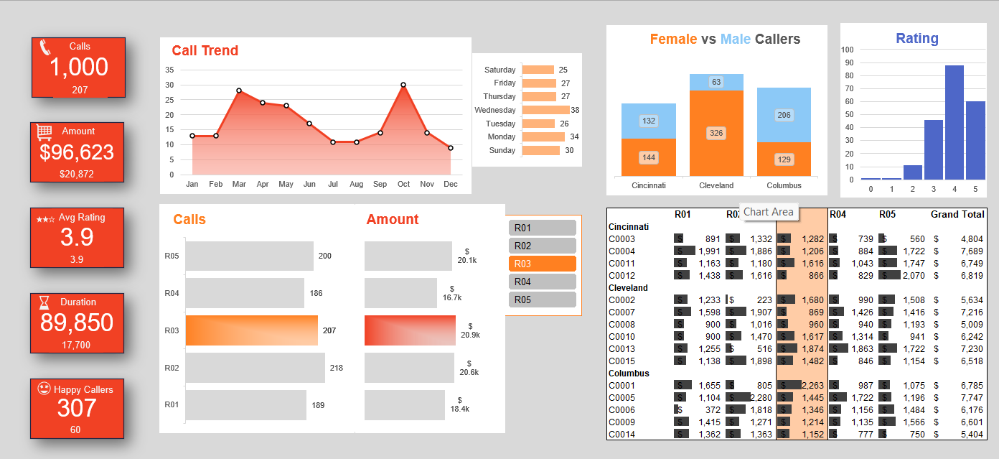

# 📞 Call Center Performance Dashboard

An interactive Excel dashboard project to visualize and analyze call center performance across multiple regions using Power Pivot, Pivot Tables, and Slicers.

## 📊 Overview
This dashboard helps stakeholders understand key performance indicators (KPIs) for a call center operation including:
- Total number of calls
- Average call time
- Customer satisfaction ratings
- Gender-based caller distribution
- Region-wise breakdown

## 🛠️ Tools & Techniques
- Microsoft Excel
- Power Pivot
- Pivot Tables
- Slicers
- Conditional Formatting

## 📂 Excel Workbook Structure
| Sheet Name | Description |
|------------|-------------|
| **RawData** | Contains the original dataset with call records |
| **PivotTable** | Summary tables using Power Pivot |
| **Dashboard** | Visual dashboard with charts, slicers, and KPIs |

## ⚙️ Features
- **Dynamic Filtering:** Slicers for Region, Gender, and Date
- **Visual Insights:** Conditional formatting and bar/pie charts
- **Interactive KPIs:** Real-time updates with filters
- **Usability Enhancements:** Clean layout and auto-summarized metrics

## 📝 How to Use
1. Open the Excel file.
2. If prompted, click **"Enable Content"**.
3. Use slicers to filter data dynamically.
4. Explore KPI charts and pivot summaries.

## 📷 Dashboard Preview

## 🔗 Live Link
[GitHub Repository](https://github.com/Riya20arora/Call-Center-Performance-Dashboard)

## 👩‍💻 Author
**Riya Arora**  
📧 [riya2007arora@gmail.com](mailto:riya2007arora@gmail.com)  
🌐 [GitHub: Riya20arora](https://github.com/Riya20arora)
